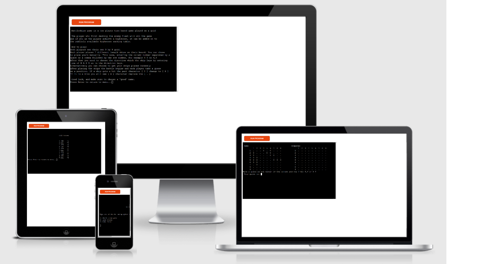

<h1 align="center">Grid Battlefield (a battleships game)</h1>

The pencil and paper game implementation in a terminal application.

Battleships is a turn based, two player game, set in a indexed finite grid space. This app allow you to play against the computer.

As a child I played this game with my father with somewhat different setup, called Battleplanes. My ultimate goal is to have the well known Battleships game and the derived Battleplanes game mode implemented in the application.

[View the live project here.](https://grid-battle.herokuapp.com/)

# Table of content

+ [Gameplay instructions](#gameplay)
+ [Features](#features)
+ [Design Process](#design-process)
+ [Technologies used](#technologies-used)
+ [Testing](#testing)
+ [Deployment](#deployment)
+ [Credits](#credits)

***

<h2 id="gameplay">How to play</h2>
<a href="#table-of-content">Go back 🔝</a>

-   The game play consist of two phases. The placement phase, and the battle phase. On starting a new game, first the user have to choose a name for his commander, and decide on random or manual placement for the ships.

-   The game rules were chosen from [this](http://www.papg.com/show?1TMC) website.

-   Further game rules can be viewed in the application 'game rules'
## Features
<a href="#table-of-content">Go back 🔝</a>

- Main menu - where user can initiate the following available options

- Battleships game
    - Username, and other user input validation
    - Random/manual ship placement
    - Sank ship announcement
    - Impossible game difficult in a special case

- High scores - stored in a spreadsheet on Google cloud
    - High scores can be viewed from the menu
    - If a player achieves high score it can be added on to the list

- A description of the game rules

- ~~Battleplanes game mode~~

    ### Features left to implement:

    -   reverse impossible difficulty
    -   cancel ship placement on direction change
    -   Battleplanes game mode

## Design Process
<a href="#table-of-content">Go back 🔝</a>

### Base Plan

-   #### User Stories
    1.  As a new user I want to get a general unambiguous read of the game rules.
    1.  As a user I want to be able to play a game, with clear responses of the game state.
    1.  As a user I want to review other players achieved top scores.

-   #### Application Aim
    -   To communicate the game course clearly.
    -   To give the option for the player to save an achieved high score.
    -   To allow the user to have an unambiguous, error free, gameplay experience.
-   #### Roadmap
    1.  *Menu* - main menu with multiple options ✔
    1.  *Battleships game* - the main game implementation ✔
    1.  *High scores* - stored in spreadsheet on cloud ✔
    1.  *Game rules* - description of game rules ✔
    1.  *Battleplanes game mode* - the special game ❌
    1.  Testing ✔

### Flowchart

To have an understanding of the required step for the application, I have created the following flowchart using draw.io.

### Data Model

Following the flowchart I have tried to map all the necessary data relations to create the data model.
Halfway through development I began to realize how to *think* to approach modeling data. The updated chart below shows most of the data model utilized. Unfortunately it doesn't completely reflect the implemented code, but this is the foundation it lays on.

### File Structure

I chose `src` as in 'source code' for the folder name where the python scripts exist.
I have separated class definitions as `/classes`.

## Technologies Used
<a href="#table-of-content">Go back 🔝</a>

### Languages Used

-   [Python](https://en.wikipedia.org/wiki/Python_(programming_language))

### Frameworks, Libraries & Programs Used

1. [Git](https://git-scm.com/)
1. [GitHub](https://github.com/)
1. [draw.io](https://www.diagrams.net/)

## Testing
<a href="#table-of-content">Go back 🔝</a>

### Validators Testing
-   [W3C Markup Validator](https://jigsaw.w3.org/css-validator/#validate_by_input)
-   [W3C CSS Validator](https://jigsaw.w3.org/css-validator/#validate_by_input)
-   [Python](http://pep8online.com/)

### Testing User Stories
1.  As a new user I have quick access to the game rules from the main menu. The text can be improved, but shows all the necessary info in a short read to prepare for the first game.
1.  As a user I get clear feedback in text form about what happening and why.
1.  As a user I can achieve a high score and have access to look at other people achieved scores.
### Further Testing

-   ~~Friends and family members were asked to review the app~~ (not the final version)
-   Throughout the whole development the debugging tool was my best friend. Implementing each feature required to manually retest each of the application features.
-   

### Future improvements, optimizations

-   in board.py get_ocupied_coords can be memoized
-   the game board could be printed only if it is changed

### Found Bugs

During the development process I have encountered and produced several bugs and errors that required a fix. I have documented the causes and solutions here.

-   String delimiter error: `SyntaxError: f-string: expecting '}'`
    -   Intent:
        -   To center the computers game board. 
    -   Cause:
        -   I have used an f-string, and in the curly braces I had an expression including another string definition with the same single quote `'`. That breaks the formatted string literal.
    -   Solution:
        -   I have replaced one of the string delimiter with double quotes `"`

-   Recursion error
    -   Intent:
        -   Randomly place the ships on the board.
    -   Cause:
        -   The call stack exceeded after calling `Board.__validate_range()` from `Board.__find_ship_coords()` while the range test had a logic error of `and` instead of `or`.
    -   Solution:
        -   Swapped `and` with `or` 

-   EOFError while debugger encountered an input()
    -   Intent:
        -   VSCode debugger tool usage.
    -   Cause:
        -   The `launch.json` debug configuration file default setting on the `"console"` was `"integratedConsole"` which didn't allow (or as far as I could tell) to pass in input str. 
    -   Solution:
        -   Using VSCode IntelliSense suggestions (by pressing `Ctrl`+`Space`) I have found the `"integratedTerminal"` option, that eliminated the error and allow me to take advantage of the debugger.

-   TypeError while trying to unpack a tuple on one line
    -   Intent:
        -   To "save some time" and line of code, I have tried to unpack a tuple that is 1 indexed game coordinate, perform the subtraction on each number to convert it to 0 indexed and repack it in to a tuple in one line.
    -   Cause:
        -   Ultimately the following expression `[(x,y) for x,y in (int1,int2)]` raised `TypeError: cannot unpack non-iterable int object`. That is exactly as the error message states, as in `x,y = 1` case.
    -   Solution:
        -   While figuring out the issue, I have tried several solutions and none of them looked pleasing, and as I am just getting familiar with Python, while playing around in Python interpreter, I have stumbled upon generator expressions. For that, my personal goal to making this calculation a one liner concluded on `next(((x,y) for x,y in ((1,2),)))`. I understand this is really hard to read but as a personal discovery I intend to leave it in the final code, with a descriptive comment, unless I find a better solution.
        -   I have found a better solution...
    

### Known Bugs

-   ?

## Deployment
<a href="#table-of-content">Go back 🔝</a>

The project was deployed using Code Institute's mock terminal for Heroku.

-   Steps for deployment:
    -   Fork or clone this repository
    -   Create a new Heroku app
    -   In the app settings:
        -   Add a config var of `PORT`:`8000`
        -   Set the buildpacks to `Python` and `NodeJS` in that order
    -   Link the Heroku app to the forked repository
    -   Manually **Deploy**

## Credits
<a href="#table-of-content">Go back 🔝</a>

### Code Reference

-   [Python Docs](https://docs.python.org/3.8/)
-   [Markdown Guide](https://www.markdownguide.org/cheat-sheet/)

-   [How to clear screen with Python](https://stackoverflow.com/questions/2084508/clear-terminal-in-python#answer-36941376)
-   [Iterator in Python](https://docs.python.org/3/glossary.html#term-iterator)
-   [Python Generators](https://www.python.org/dev/peps/pep-0255/#specification-yield)
-   [To test and build Regular Expressons](https://regexr.com/)
-   [Python RegEx documentation](https://docs.python.org/3/howto/regex.html#performing-matches)
-   [Gspread API reference](https://docs.gspread.org/en/latest/api.html?highlight=insert%20row#gspread.worksheet.Worksheet.insert_row)
-   [Generate random letter](https://stackoverflow.com/questions/2823316/generate-a-random-letter-in-python#answer-2823357)

### Acknowledgements

-   Code Institute for the deployment terminal
-   Code Institute Love Sandwiches API access code core
-   [Pen and paper](http://www.papg.com/show?1TMC) website for the game rules reference
-   README.md structure inspired by several Code Institute's samples
-   My mentor for all the great tips, and valuable insights